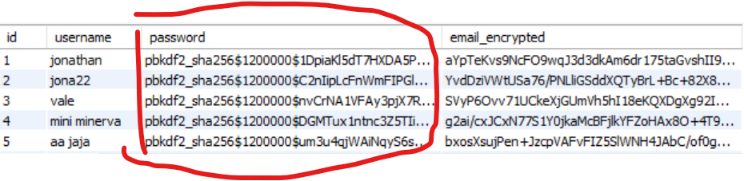
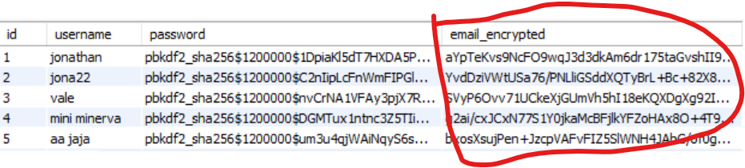
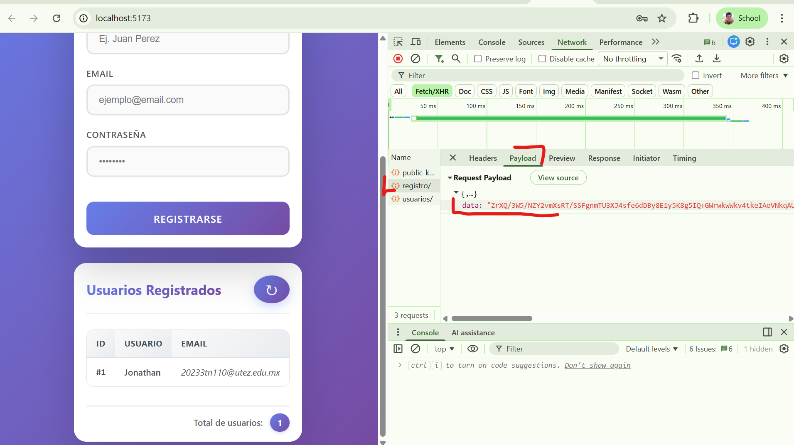
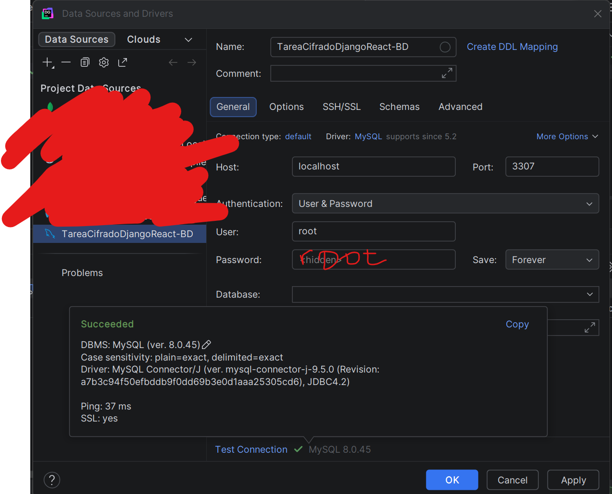
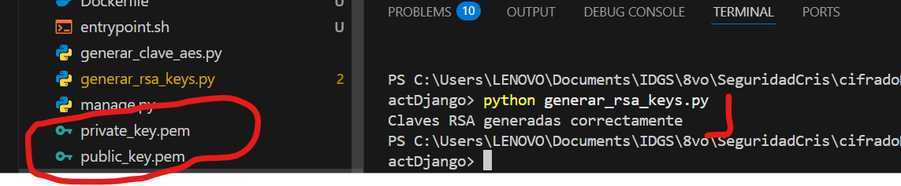
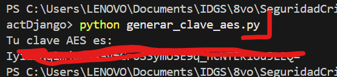

#  Sistema de Registro Seguro con Cifrado Multicapa

##  Objetivo del Proyecto

Este proyecto implementa un **sistema de registro de usuarios con múltiples capas de seguridad**, demostrando las mejores prácticas de protección de datos sensibles:

### 1. Hash Irreversible de Contraseñas (PBKDF2)

Las contraseñas **NUNCA** se almacenan en texto plano. Se utiliza el algoritmo **PBKDF2** (Password-Based Key Derivation Function 2) con SHA-256, que genera un hash irreversible de un solo sentido.

**¿Por qué es importante?**
- Si la base de datos es comprometida, las contraseñas **no son vulnerables**

 

---

### 2. Cifrado en Reposo de Datos Sensibles (AES-256-GCM)

Los datos sensibles como el **correo electrónico** se cifran usando **AES-256-GCM** (Advanced Encryption Standard) antes de guardarse en la base de datos.

**¿Por qué es importante?**
- Algoritmo simétrico (se genera una llave a la cual solo el back ocupará para guardar el dato de una manera cifrada y descifrarlo con esa misma llave para poder devolver el dato de una manera legible)
- Incluso con acceso a la BD, los datos son ilegibles sin la clave
- Protección contra filtraciones de información. En este caso tal vez un correo no es algo sensible, pero datos bancarios, por ejemplo el dinero en la cuenta de una persona o algun dato muy personal, es mejor que se guarde cifrado, sabiendo que en este caso no es irreversible como si lo es el hash.


---

### 3. Cifrado en Tránsito (RSA-2048)

Los datos viajan cifrados desde el navegador hasta el servidor usando **RSA-2048**.

**¿Por qué es importante?**
- Cifrado asimétrico de clave pública/privada
- Protección adicional incluso antes de HTTPS/TLS
- El frontend cifra con la clave pública
- Solo el backend puede descifrar con la clave privada
- **Doble capa de seguridad**: RSA + SSL/TLS en producción



**Flujo completo:**
```
1. Frontend solicita clave pública RSA
2. Frontend cifra: {username, email, password}
3. Envía datos cifrados al backend
4. Backend descifra con clave privada
5. Backend hashea password + cifra email
6. Guarda en base de datos
```


---

## 📦 Tecnologías Utilizadas

| Tecnología | Uso |
|------------|-----|
| **Django > 5.1** | Backend API REST. De manera local se probó con la versión 6.0.2, pero en Docker al ser una versión muy nueva dió conflicto, por ende si se opta por levantar el proyecto en Docker, se usará la versión 5.1 |
| **React 19 + Vite** | Frontend SPA |
| **MySQL 8.0** | Base de datos |
| **Docker** | Containerización (Opcional) |
| **Cryptography (Python)** | AES-256-GCM, RSA-2048 |
| **Web Crypto API (JS)** | Cifrado RSA en navegador |

---

## Instalación y Ejecución

### 🐳 Opción 1: Con Docker (Recomendado)

**Requisito previo:** Docker Desktop instalado ([Descargar aquí](https://docs.docker.com/desktop/setup/install/windows-install/))

#### Pasos:

1. **Ejecutar el proyecto:**

   **Clonar el proyecto:**
   ```bash
   git clone https://github.com/JonathanAlbertoBarrera/cifradoDatosReactDjango
   ```

   **A nivel raiz del proyecto clonado (al mismo nivel que el docker-compose.yml):**
   ```bash
   docker compose up -d
   ```

2. **Esperar a que los contenedores inicien** (primera vez tarda ~2-3 minutos o más dependiendo del equipo de cómputo)

3. **Acceder al frontend:** http://localhost:5173

3. **(Opcional) Conectarse a la bd:** Con los siguientes valores en Data grip o la opción de preferencia:




####  Ventajas de usar Docker:

-  **Claves AES y RSA se generan automáticamente** en el contenedor
-  **No necesitas instalar MySQL, Python ni Node.js**
-  **Todo queda aislado en contenedores**
-  **Mismo entorno en cualquier sistema operativo**
-  **Las claves permanecen en el contenedor** (no ensucian tu carpeta local)


---

###  Opción 2: Instalación Manual / Local

**Requisitos previos:**
- Python 3.11+
- Node.js 20+
- MySQL 8.0

#### Pasos:

**1. Configurar Backend (Django)**

```bash
# Instalar dependencias Python
pip install -r requirements.txt
```

- O si ya tienes algunas dependencias o asi lo deseas, puedes instalar de manera individual. Nota: No es necesario especificar las versiones como en requirements.txt, al menos de manera local si funciona todo bien con las últimas versiones:

```bash
# Instalar dependencias Python
pip install django
pip install djangorestframework
pip install mysqlclient
pip install cryptography
pip install python-dotenv
pip install django-cors-headers
```

**2. Configurar Base de Datos MySQL**

Crea la base de datos:
```sql
CREATE DATABASE ejemplo_cifrado;
```

Copia el archivo `.env.example` para crear tu archivo `.env`:

Edita el archivo `.env` con tus datos de MySQL:
```env
# Base de datos
DB_HOST=localhost
DB_PORT=3306
DB_NAME=ejemplo_cifrado
DB_USER=root
DB_PASSWORD=tu_password_mysql_aqui

# Seguridad - AES (se llenará en el paso 3)
AES_SECRET_KEY=

# Django
DJANGO_SECRET_KEY=tu-clave-secreta-django
```

**3. Generar Claves de Cifrado RSA:**
En una terminal a nivel raíz del proyecto ejecuta:
```bash
# Generar claves RSA (2048 bits)
python generar_rsa_keys.py
#  Esto crea: private_key.pem y public_key.pem
```


**4. Generar clave AES:**
En una terminal a nivel raíz del proyecto ejecuta:
```bash
$ python generar_clave_aes.py
#Tu clave AES es:
valorrecibido..

# ⚠️ IMPORTANTE: Copia esa clave y pégala en tu .env
```

Abre tu `.env` y pega la clave:
```env
AES_SECRET_KEY=valorrecibido
```



> **IMPORTANTE:** Si no configuras `AES_SECRET_KEY`, obtendrás este error al iniciar:
> ```
> ValueError:  ERROR: AES_SECRET_KEY no está configurada.
>    Para uso local: genera la clave con 'python generar_clave_aes.py'
>    y agrégala a tu archivo .env
> ```

**4. Ejecutar Migraciones**

```bash
python manage.py makemigrations
python manage.py migrate
```

**5. Iniciar Backend**

```bash
python manage.py runserver
```

Backend corriendo en: http://localhost:8000

**6. Configurar Frontend (React)**

En otra terminal:

```bash
cd frontend/mi-app-react

# Instalar dependencias
npm install

# Configurar URL del API
# Crea un .env y asegúrate que diga:
# VITE_API_URL=http://localhost:8000

# Iniciar frontend
npm run dev
```

Frontend corriendo en: http://localhost:5173

---

##  Prueba del Sistema

### Registrar un Usuario

1. Abre http://localhost:5173 en tu navegador


2. Completa el formulario:
   - **Usuario:** prueba
   - **Email:** prueba@ejemplo.com
   - **Contraseña:** MiPassword123

3. Haz clic en **"Registrarse"**

4. Deberías ver:  "Usuario registrado correctamente"

##  Flujo Completo del Sistema

```
┌───────────────────┐
│ NAVEGADOR (React) │
└────────┬──────────┘
         │
         │ 1. Solicita clave pública RSA
         │    GET /api/public-key/
         │
         ↓
┌────────┴──────────┐
│ DJANGO BACKEND    │
│ Envía public_key  │
└────────┬──────────┘
         │
         │ 2. Cifra datos con RSA
         │    {user, email, pass} → RSA-2048
         │
         ↓
┌────────┴──────────┐
│ NAVEGADOR (React) │
│ POST /api/registro/│
│ {data: "cifrado"} │
└────────┬──────────┘
         │
         │ 3. Backend descifra con RSA
         │    private_key.pem
         │
         ↓
┌────────┴──────────┐
│ DJANGO BACKEND    │
│ 4. Hash password   │
│    PBKDF2-SHA256   │
│ 5. Cifra email     │
│    AES-256-GCM     │
└────────┬──────────┘
         │
         │ 6. Guarda en BD
         │
         ↓
┌────────┴──────────┐
│ MYSQL DATABASE    │
│ username: texto   │
│ password: hash    │
│ email: cifrado    │
└───────────────────┘
```

---

